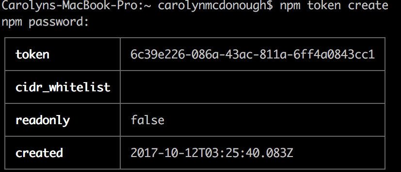
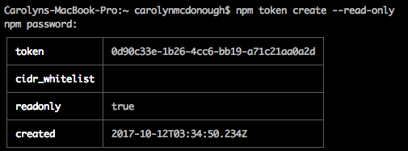
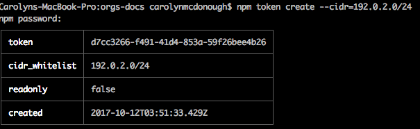
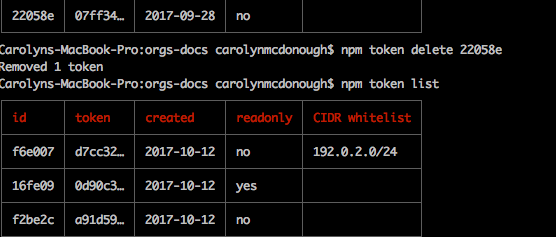

# 使用token

本文主要介绍如何通过使用**令牌(token)**来增加安全性。每次登录npm，都会生成一个安全令牌。令牌用来认证你的npm账户，也提供了需要发布和使用模块的权限。令牌通常和持续集成测试环境一起使用。例如，[Travis-CI](https://travis-ci.org/)提供了一个可以赋值给令牌的环境变量，这样Travis-CI就能以你的npm用户身份运行npm，包括安装你有权限的私包。

npm中自带的Token命令行工具具有如下功能：

* 查看token，方便追踪和管理
* 创建新的token(只读／所有权限)
* 删除token
* 根据IP地址范围限制权限

## 查看已登录账户的token

可以通过下面的命令查看当前已登录账户的token：

```shell
$ npm token list
```


下面的列表用来解释token表中每一项的意思：

| 字段 | 作用 |
|---|---|
| id | 指向唯一的token |
| token | 这里是完整token的第一部分 |
| created | 创建时间 |
| readonly | 如果是`no`，则具有所有权限 |
| CIDR whitelist | 指定范围IP地址使用的限制token |

一个token可以同时设置`CIDR whitelist`和`readonly`。

如果在个人设置中开启了2FA验证，就多了一层防护机制。没有人可以在不提供第二层验证(OTP)的情况下修改你账户的token。

**注意：表格中显示的token只是截取的token的一部分。如果想看完整的token请戳👉[npmrc](https://ninjiahub.github.io/Tools-Tricks/npm/docs/config-npm/npmrc.md)**

## 创建新token

```shell
$ npm token create [--readonly] [--cidr=list]
```

创建token之前，思考使用哪种token合适：

* read-only(安装／发行权限)
* full permission(发布权限)
* CIDR whitelist(通过ip地址限制权限)

如果在新建token时不指定，则该token默认具有所有权限。

* read-only：允许安装
* full-permission：允许安装、发行、发布，以及你账户拥有的所有其他权限
* CIDR whitelist token只允许特定的ip地址范围内的用户使用。可以在一个公司或者团队中使用这种限制token。目前支持IPv4。

如果一个token被设置为`read-only`权限，则该token没有权限对包做任何修改。如果一个token在创建时没有明确地设置为`read-only`权限，则默认拥有全部权限，包括发布和修改npm包。

### 创建拥有全部权限的新token

要创建一个拥有全部权限的新token，使用：

```shell
$ npm token create
```

如果开启了2FA，npm会提示输入npm密码，以及OTP，之后，npm会列出如下表格：



**注意：只有在创建时才能看到完整的token，所以请对这个token的值截图保存。**

由于没有明确指定`--read-only`，所以readonly部分的值为false，即该token默认拥有当前登陆npm账户的所有权限。

### 创建一个新的**read-only**权限token

可以使用`npm token create` 中的`--read-only`选项来生成一个`read-only`权限的token。

如果开启了2FA，npm会提示输入npm密码，以及OTP，之后，npm会列出如下表格：



从上面的表格中可以看到，`readonly`项被设置为`true`。

### 创建具有CIDR限制的token

为了限制token只能在指定的ip地址中使用，可以创建一个CIDR限制的token。CIDR是**Classless Inter-Domain Routing**的缩写，详情请戳👉[CIDR Wiki](https://en.wikipedia.org/wiki/Classless_Inter-Domain_Routing)。

例如：

```shell
$ npm token create --cidr=102.0.2.0/24
```
如果开启了2FA，npm会提示输入npm密码，以及OTP，之后，npm会列出如下表格：



如果输入的CIDR字符串无效，npm可能会给出如下的错误信息：

> npm ERR! CIDR whitelist contains invalid CIDR entry: X.X.X.X./YY,Z.Z.. . .

**注：npm现在只支持IPv4。**

### 创建CIDR限制且只读的token

```shell
$ npm token create --read-only --cidr=list
```

### 移除token

npm允许删除一个任意时间创建的token，这样就可以允许使用者收回权限。

删除token命令：

```shell
$ npm token delete <id | token>
```

删除步骤：

* 1、使用`npm token list`找出所有token
* 2、找到要删除token对应的id
* 3、使用`npm token delete <id>`删除token，这里的**id**指token列表中对应token前的id

最后使用`npm token list`列出所有token的列表来查看对应的token是否成功删除：



## 参考

* [Working with tokens](https://docs.npmjs.com/getting-started/working_with_tokens)

## 声明

本文部分内容来自网络，如有版权问题请联系作者。

侵删。

内容如有不恰当或错误，敬请指正。

作者邮箱：<web.taox@gmail.com>

## Author Info ✒️

* [GitHub](https://github.com/Tao-Quixote)
* Email: <web.taox@gmail.com>
