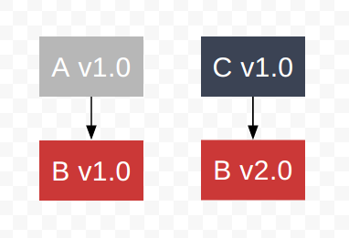
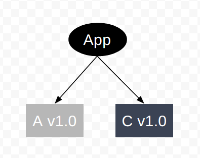
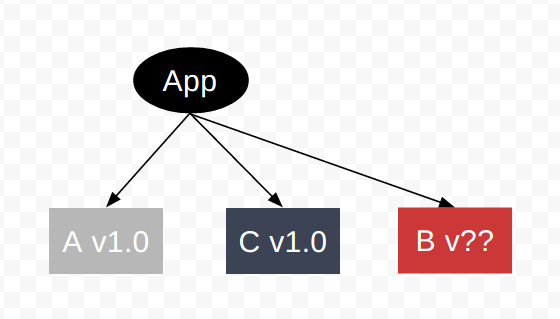
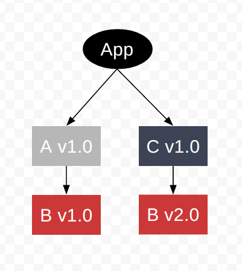
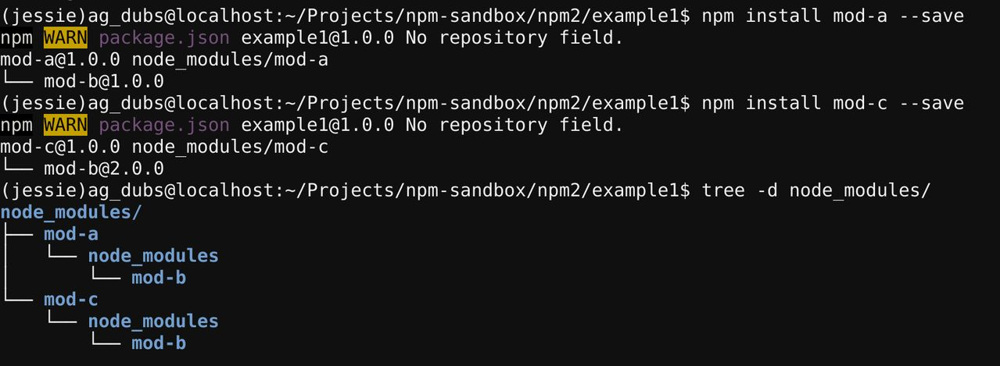
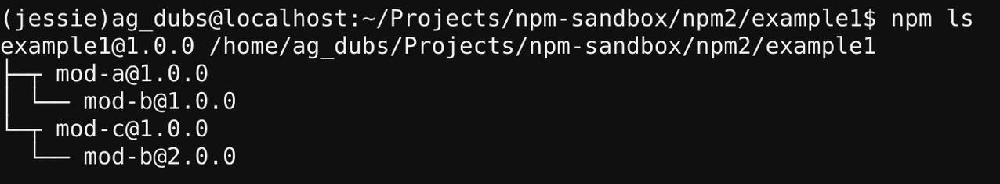
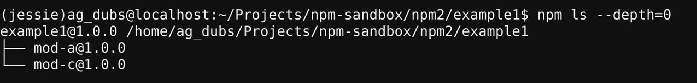

# npm v2依赖解析

假设有三个模块：A、B和C。A依赖B模块的**v1.0**版本；C也依赖B模块，但是依赖B的**v2.0**版本。根据这种依赖关系可以有：



现在，我们创建一个应用，该应用需要加载A和C模块：



## 依赖地狱

包管理器需要提供B模块的一个版本。在Node.js之前的所有运行时中，包管理器都会试图去做这件事情，这就是依赖地狱(这里该提供B模块的哪一个版本？)：



npm将B模块的两个版本都放在目录树中，B模块的每一个版本都嵌套在依赖它的模块的子目录(node_modules)中，而不是尝试加载B模块的一个单一版本：



在终端中，这种依赖的结构如下：



可以通过**npm ls**命令列出依赖关系：



如果只想列出初级依赖关系，可以使用下面的命令：

```shell
$ npm ls --depth=0
```


## npm & Node.js模块加载器

然而，npm这样做是不够的。尽管模块的嵌套位置允许同一个模块的不同版本共生，大多数模块加载器并不能加载同一个模块的不通版本到内存中。幸运的是，Node.js的模块加载器就是为了这种情况写的，并且可以轻松的以不会彼此冲突的方式加载同一个模块的不同版本。

为什么npm和Node.js的模块加载器可以如此完美的共生？它们的大部分都是由同一个人，npm，Inc.的CEO Isaac Z. Schlueter写的。像一张纸的两面，npm和Node.js模块加载器使Node.js成为一个独一无二的适合依赖管理的运行时。

## 原文链接

* [npm v2 Dependency Resolution](https://docs.npmjs.com/how-npm-works/npm2)

## 声明

本文翻译源内容来自网络，即NPM官方文档，如有版权问题请联系译者。

侵删。

内容如有不恰当或错误，敬请指正。

作者邮箱：<web.taox@gmail.com>

## Author Info

* [GitHub](https://github.com/Tao-Quixote)
* Email: <web.taox@gmail.com>