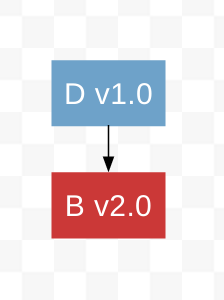
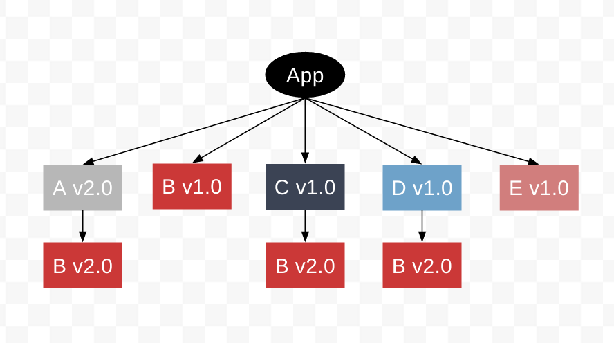

# npm3依赖重复以及去重

继续前面的例子。现在我们有一个依赖两个模块的应用：

* 模块A，依赖模块B的**v1.0**版本
* 模块C，依赖模块B的**v2.0**版本


那么问题来了：如果我们现在安装一个依赖**v1.0**版本或者**v2.0**版本的模块B，npm将会如何处理这个被依赖的模块B。

## 例子

假设我们现在需要另外一个包，模块D。模块D同模块C一样，都依赖模块B的**v2.0**版本：



因为**B v1.0**已经是一个**顶层依赖(top-level dependency)**，所以我们不能再将**B v2.0**作为顶层依赖来安装(npm包的版本通过**package.json**文件中的**version**属性来控制，在同一个层级的目录中安装同一个包的不同版本，后安装的包会覆盖前面安装的包)。因此，即使在模块C中已经安装了一个嵌套的模块B的拷贝，仍然需要将**B v2.0**作为模块D的嵌套依赖来安装。


如果一个**次级依赖(的某个版本)**被2个或者2个以上的模块所依赖，但是并没有作为一个顶层依赖安装在目录层级(**/node_modules**)中，那么这个版本的模块将会重复出现在每个依赖该版本的模块的子级目录中。

然而，如果一个次级依赖被2个或者2个以上的模块所以来，但是是作为一个顶层依赖安装在目录层级中，那么所有依赖该模块的**初级依赖**都将共享该模块，并不会重复出现在每个依赖该版本的模块的子级目录中。

假设我们需要依赖模块E，该模块同模块A一样，依赖模块B的**v1.0**版本：


因为**B v1.0**已经是一个顶层依赖，所以npm不需要重复安装、嵌套它。npm只是简单地安装模块E，模块E和模块A共享**B v1.0**。


在终端中看时，目录结构如下：


现在，如果更新模块A到**v2.0**版本，该版本依赖模块B的**v2.0**版本而不是**v1.0**版本，npm会怎么处理呢：


**关键是记住：安装顺序决定一切。**

即使在**package.json**文件中模块A(v1.0)是第一个安装的(package.json中记录的包名是根据字母顺序排序的)，但是当我们在终端中通过**npm install**命令再次安装时，模块A(v2.0)却是最后一个安装的。

当我们运行**npm install mod-a@2 --save**时，npm3会依次做如下几件事情：

* 移除模块A的**v1.0**版本
* 安装模块A的**v2.0**版本
* 因为模块E v1.0依赖**B v1.0**，所以保持不变
* 因为模块B的**v1.0**版本占据了目录层级中的顶层，所以会在模块A(v2.0)的子级目录中嵌套安装模块B的**v2.0**版本



在终端中看时，目录结构如下：


最后，如果升级模块E到**v2.0**版本，该版本的模块E也依赖模块B的**v2.0**版本，就像升级模块A一样：


此时，npm3会依次执行下列操作：

* 移除模块E的**v1.0**版本
* 安装模块E的**v2.0**版本
* 因为没有模块再依赖模块B的**v1.0**版本，所以移除该模块的**v1.0**版本
* 因为顶层目录(**/node_modules**)中不存在模块B的任何版本，所以将**B v2.0**作为顶层依赖安装在顶层目录(**/node_modules**)中


在终端中看时，目录结构如下：


现在，几乎每个初级依赖中都有模块B的**v2.0**版本，所以这显然是不合理的。为了解决重复，可以使用：

```shell
$ npm dedupe
```

这条命令会解析所有依赖模块B(v2.0)的模块(A、C、D、E)，然后重定向这些模块中依赖的模块B到顶层目录中的**B v2.0**，然后移除这些模块中重复嵌套安装的模块B(v1.0)。


在终端中看时，目录结构如下：


## 原文链接

* [npm3 Duplication and Deduplication](https://docs.npmjs.com/how-npm-works/npm3-dupe)

## 声明

本文翻译源内容来自网络，即NPM官方文档，如有版权问题请联系译者。

侵删。

内容如有不恰当或错误，敬请指正。

作者邮箱：<web.taox@gmail.com>

## Author Info

* [GitHub](https://github.com/Tao-Quixote)
* Email: <web.taox@gmail.com>
