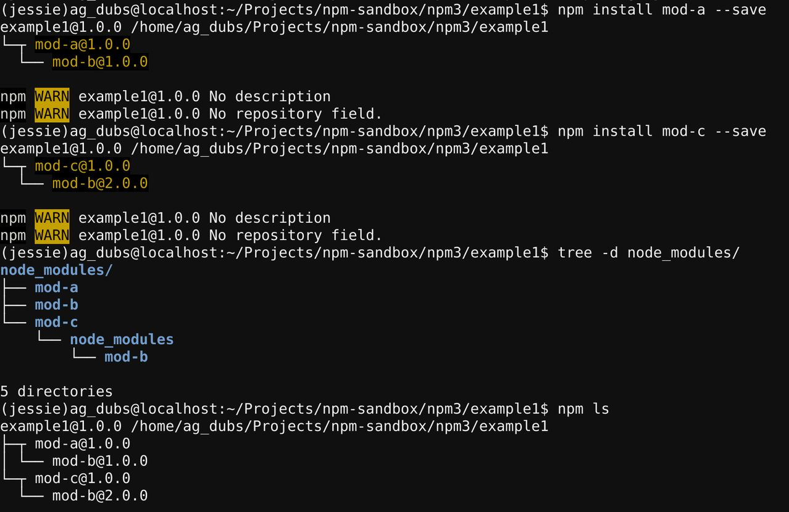

# npm v3依赖解析

npm3解析依赖的方式不同于npm2。

npm2以嵌套的方式安装所有的依赖，npm3则会尝试减少由于嵌套引起的深层树和冗余。npm3会尝试以扁平的方式安装次级依赖(依赖的依赖)，将次级依赖安装在依赖它的初级依赖的同级目录中。

主要区别如下：

* 在目录结构中的位置不再能表示一个依赖的类型(初级依赖、次级依赖等)
* 依赖解析取决于安装顺序，或者安装的顺序将会影响**node_modules**目录的结构

## 例子

假设我们有一个A模块，A依赖B：


现在，创建一个依赖模块A的应用。npm3中的**npm install**命令会将模块A及其依赖，模块B，扁平地安装在**/node_modules**目录中。

在npm2中，这种情况将会以嵌套的方式安装：


现在假设我们需要安装C模块，C依赖B模块的另外一个版本：


现在，因为**B v1.0**已经在顶级目录(**/node_modules**)中，所以我们不能将**B v2.0**作为顶层依赖安装。**npm v3**在处理这种情况时，会默认采取**npm v2**的方式，将这个新的不同版本的模块B嵌套在依赖它的模块(在这个例子中为模块C)的子级目录中：


在终端中，目录嵌套结构如下：



可以通过**npm ls**列出所有的依赖以及依赖之间的关系：


如果只想看初级依赖，可以使用：

```shell
$ npm ls --depth=0
```


## 进阶

* [npm3依赖重复以及去重](https://ninjiahub.github.io/Tools-Tricks/npm/docs/how-npm-works/npm3-dupe)

## 原文链接

* [npm v3 Dependency Resolution](https://docs.npmjs.com/how-npm-works/npm3)

## 声明

本文翻译源内容来自网络，即NPM官方文档，如有版权问题请联系译者。

侵删。

内容如有不恰当或错误，敬请指正。

作者邮箱：<web.taox@gmail.com>

## Author Info

* [GitHub](https://github.com/Tao-Quixote)
* Email: <web.taox@gmail.com>