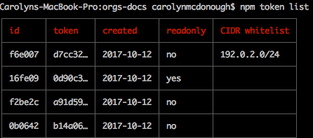
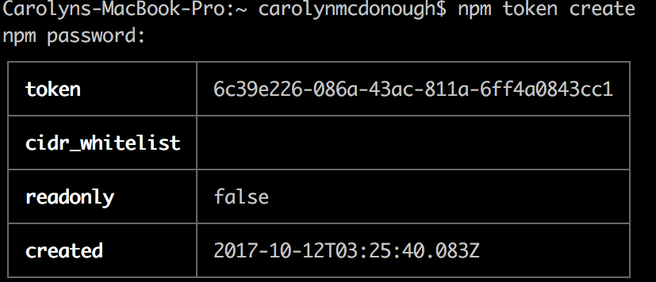

# 使用token

本文主要介绍如何通过使用**令牌(token)**来增加安全性。每次登录npm，都会生成一个安全令牌。令牌用来认证你的npm账户，也提供了需要发布和使用模块的权限。令牌通常和持续集成测试环境一起使用。例如，[Travis-CI](https://travis-ci.org/)提供了一个可以赋值给令牌的环境变量，这样Travis-CI就能以你的npm用户身份运行npm，包括安装你有权限的私包。

npm中自带的Token命令行工具具有如下功能：

* 查看token，方便追踪和管理
* 创建新的token(只读／所有权限)
* 删除token
* 根据IP地址范围限制权限

## 查看已登录账户的token

可以通过下面的命令查看当前已登录账户的token：

```shell
$ npm token list
```



下面的列表用来解释token表中每一项的意思：

| 字段 | 作用 |
|---|---|
| id | 指向唯一的token |
| token | 这里是完整token的第一部分 |
| created | 创建时间 |
| readonly | 如果是`no`，则具有所有权限 |
| CIDR whitelist | 指定范围IP地址使用的限制token |

一个token可以同时设置`CIDR whitelist`和`readonly`。

如果在个人设置中开启了2FA验证，就多了一层防护机制。没有人可以在不提供第二层验证(OTP)的情况下修改你账户的token。

**注意：表格中显示的token只是截取的token的一部分。如果想看完整的token请戳👉[npmrc](https://github.com/NinjiaHub/Tools-Tricks/blob/master/npm/documents/config-npm/npmrc.md)**

## 创建新token

```shell
$ npm token create [--readonly] [--cidr=list]
```

创建token之前，思考使用哪种token合适：

* read-only(安装／发行权限)
* full permission(发布权限)
* CIDR whitelist(通过ip地址限制权限)

如果在新建token时不指定，则该token默认具有所有权限。

* read-only：允许安装
* full-permission：允许安装、发行、发布，以及你账户拥有的所有其他权限
* CIDR whitelist token只允许特定的ip地址范围内的用户使用。可以在一个公司或者团队中使用这种限制token。目前支持IPv4。

如果一个token被设置为`read-only`权限，则该token没有权限对包做任何修改。如果一个token在创建时没有明确地设置为`read-only`权限，则默认拥有全部权限，包括发布和修改npm包。

### 创建拥有全部权限的新token

要创建一个拥有全部权限的新token，使用：

```shell
$ npm token create
```

如果开启了2FA，npm会提示输入npm密码，以及OTP，之后，npm会列出如下表格：



**注意：只有在创建时才能看到完整的token，所以请对这个token的值截图保存。**

由于没有明确指定`--read-only`，所以readonly部分的值为false，即该token默认拥有当前登陆npm账户的所有权限。

## 参考

* [Working with tokens](https://docs.npmjs.com/getting-started/working_with_tokens)

## 声明

本文部分内容来自网络，如有版权问题请联系作者。

侵删。

内容如有不恰当或错误，敬请指正。

作者邮箱：web.taox@gmail.com。

## Author Info

* [GitHub](https://github.com/Tao-Quixote)
* Email: web.taox@gmail.com
