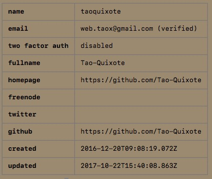
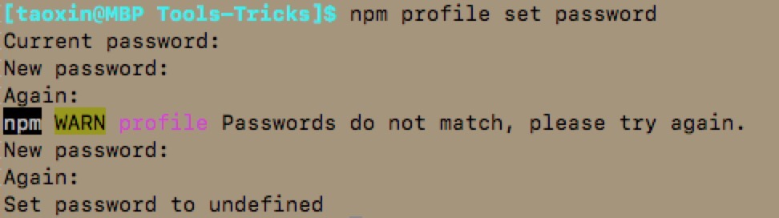

# 使用命令行修改个人简介

可以通过下面的命令查看和设置npm中的个人简介：

```shell
$ npm profile get
$ npm profile set <prop> <value>
```

## 查看&设置简介信息

查看自己在npm中的个人信息，可以使用：

```shell
$ npm profile get
```

npm会使用表格的形式展示你在npm中的个人信息：



### 可以通过CLI设置的个人信息属性

* email
* password
* fullname
* homepage
* freenode
* twitter
* github

### 重置密码

通过CLI设重置密码如下：



npm命令行会提示输入当前密码，然后提示输入新密码以及确认新密码。如果两次输入的新密码不匹配，npm会提示错误然后重新输入。最后，如果设置成功，npm(5.5.1版本)会提示`Set password to undefined`。

### 设置其他属性

要设置其他的个人信息，可以通过下面的例子来设置：

```shell
$ npm profile set fullname nori pat marsupial
```

在5.x之前的版本中，在设置时npm会提示你确认操作：

```shell
$ Set fullname to nori pat marsupial
```

而在作者当前的npm版本(5.5.1)中，设置除`password`之外的信息不会提示确认，而是直接修改。

## 参考

* [Modifying Profile Settings from the Command Line](https://docs.npmjs.com/getting-started/modifying_your_profile_from_command_line)

## 声明

本文内容翻译自[官方文档 Modifying Profile Settings from the Command Line](https://docs.npmjs.com/getting-started/modifying_your_profile_from_command_line)，如有版权问题请联系译者。

侵删。

内容如有不恰当或错误，敬请指正。

作者邮箱：web.taox@gmail.com。

## Translator Info

* [GitHub](https://github.com/Tao-Quixote)
* Email: web.taox@gmail.com
