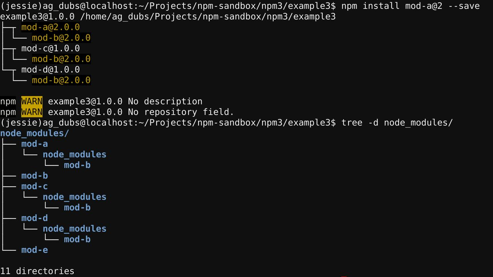
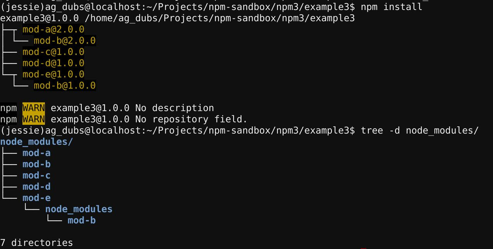

# npm3 不确定性

像我们例子中的前几页中说的那样：


**node_modules**目录的结构以及依赖树的结构，取决于**安装顺序**。

如果你和你的开发团队，同时使用 **package.json** 和交互命令行工具 **npm install** 添加包(依赖)，那么很有可能会发生的一种情况：你本地的 **node_modules** 目录和同事的 **node_modules** 目录是不一样的，而且还有可能和展示机、测试机以及生产环境服务器中的 **node_modules** 目录也不一样。

简单地说，**npm3 安装依赖的结果并不是确定的。**

这或许有点难以接受，我们将在本文中讨论这种情况是如何发生的。虽然安装的依赖的结构并不是一定的，但是这并不会对你的应用造成不好的影响。

## 例子

让我们跳回之前的一个示例应用：


在这个例子中，应用的 **package.json**文件如下：

```package.json
{
  "name": "example3",
  "version": "1.0.0",
  "description": "",
  "main": "index.js",
  "scripts": {
    "test": "echo \"Error: no test specified\" && exit 1"
  },
  "keywords": [],
  "author": "",
  "license": "ISC",
  "dependencies": {
    "mod-a": "^1.0.0",
    "mod-c": "^1.0.0",
    "mod-d": "^1.0.0",
    "mod-e": "^1.0.0"
  }
}
```

在使用 **npm install**命令安装依赖时，我们将会看到如下输出：


现在，假设团队中的一个开发人员要开发一个新功能，需要将模块A升级到 **v2.0**，同时改版本不再依赖模块B的 **v1.0**，而是依赖模块B的 **v2.0** 版本：


这个开发人员使用 **npm install** 命令安装了模块A的新版本，并保存到 **package.json** 文件中：

```shell
$ npm install mod-a@2 --save
```

终端输出：



依赖结构如下：


现在，假设这个开发人员完成了这个依赖新版本模块A的功能并推送到一个测试服务器上，运行 **npm install** 命令安装 **package.json** 中的记录的依赖，此时 **package.json**文件的内容：

```package.json
{
  "name": "example3",
  "version": "1.0.0",
  "description": "",
  "main": "index.js",
  "scripts": {
    "test": "echo \"Error: no test specified\" && exit 1"
  },
  "keywords": [],
  "author": "",
  "license": "ISC",
  "dependencies": {
    "mod-a": "^2.0.0",
    "mod-c": "^1.0.0",
    "mod-d": "^1.0.0",
    "mod-e": "^1.0.0"
  }
}
```

安装完成后，终端显示信息：



整理后更直观的视图如下：


从结果可以看出，这个树结构和前面这个开发人员本地机器上的依赖树结构大相径庭。

**牢记：安装顺序决定依赖树的结构。**

### 开发人员本地机器

当开发人员通过 **npm install** 升级模块A到 **v2.0** 版本时，模块A是最后一个安装的包。因为在刚开始这个项目的时候，已经运行过 **npm install** 命令来安装记录在 **package.json** 中的包，之后才安装了模块A的 **v2.0** 版本。

在刚开始通过 **npm install** 安装记录在 **package.json** 文件中的依赖时，模块A **v1.0** 的依赖模块B的版本为 **v1.0**，因为没有其他版本的模块B，所以 **B v1.0** 作为顶层依赖被安装在了 **node_modules** 目录中。在使用 **npm install mod-a@2** 命令升级模块A到 **v2.0** 的过程中，移除 **A v1.0** 时发现模块E对 **B v1.0** 有依赖，所以 **B v1.0** 依然作为顶层依赖存在于 **node_modules** 目录中；安装 **B v2.0** 之后，在安装依赖 **B v2.0** 时，发现 **B v1.0** 占据了顶层依赖的位置，所以 **B v2.0** 只能嵌套安装在模块A的子目录中，所以才会出现下面的结构：


### 测试服务器

测试服务器上，在通过使用 **npm install** 命令安装记录在 **package.json** 文件中的依赖时，发生的事情如下：

该项目是作为一个新项目推送到测试服务器上的，所以当前工作目录中不包含 **node_modules** 目录。然后运行 **npm install** 命令安装记录在 **package.json** 中的依赖。**package.json**中，所有依赖都是根据字母顺序记录的，所以模块A排在第一个，模块E排在最后。

* 1、执行安装时，模块A作为第一个模块被安装；
* 2、发现模块A依赖模块B，所以安装依赖模块B的 **v2.0**版本，由于没有已经安装别的版本的模块B，所以 **B v2.0** 作为顶层依赖被安装在 **node_modules** 目录中；
* 3、安装模块C和模块D时，虽然这两个模块都依赖模块B的 **v2.0**版本，但是在安装模块A时已经将 **B v2.0** 作为顶层依赖安装了，所以不再安装该模块，模块A、C和D共享该版本的模块B；
* 4、安装模块E，在安装模块E时，发现依赖模块B的 **v1.0**版本，但是由于 **B v2.0** 已经作为顶层依赖被安装，所以 **B v1.0**只能嵌套安装在模块E的子目录中。

所以，测试服务器中的依赖结构如下图：


### 不同的依赖树结构会影响应用吗？

不会。虽然依赖树的结构是不一样的，但是Node可以正确的加载不同的模块到内存中，即使同一个模块的不同版本也可以被同时加载到内存中；而且可以确保不同的模块都能正确地引用依赖模块，所以应用依赖的模块以及模块依赖的模块都能正确加载，所以即使依赖树的结构不一样，仍然不会影响应用的正常运行。

### 如何保证 node_modules 目录的结构都是一样的？

如果只是用来从 **package.json** 文件读取、安装依赖，**npm install** 命令总是生成一样的依赖树。这是因为从 **package.json** 文件得到的安装顺序总是字母顺序排列的，同样的安装顺序意味着一样的依赖树结构。

如果强迫症在任何情况下都要一样的依赖树，可以在每次修改过 **package.json** 文件后，通过移除 **node_modules** 目录，然后使用 **npm install** 重新安装所有的依赖来得到同样的依赖树。

## 原文链接

* [npm3 Non-determinism](https://docs.npmjs.com/how-npm-works/npm3-nondet)

## 声明

本文翻译源内容来自网络，即NPM官方文档，如有版权问题请联系译者。

侵删。

内容如有不恰当或错误，敬请指正。

译者邮箱：web.taox@gmail.com。

## Translator Info

* [GitHub](https://github.com/Tao-Quixote)
* Email: web.taox@gmail.com
